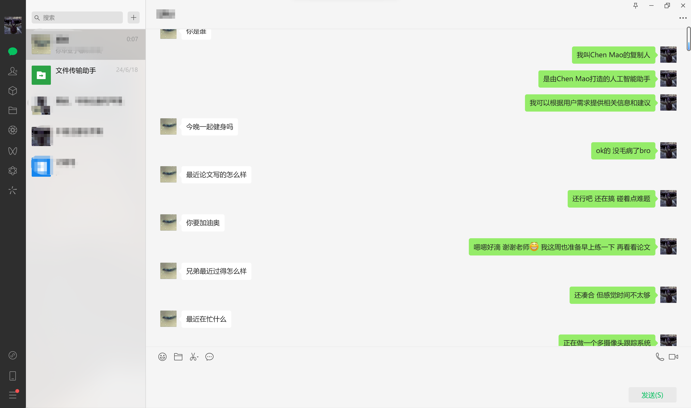
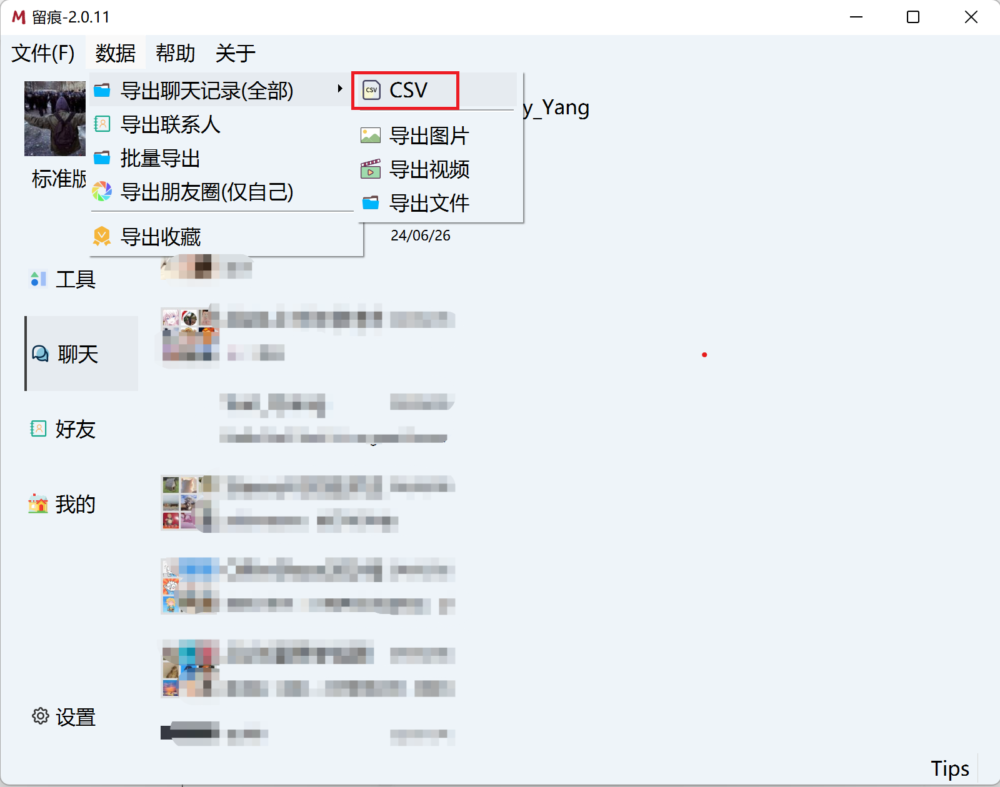
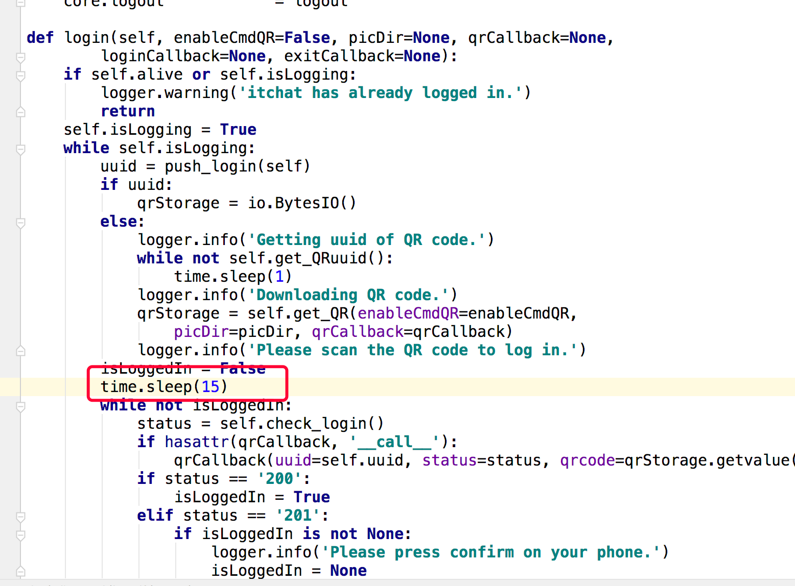

<div align="center"></div>

Please select the language you use / 请选择您使用的语言 : \[ English | [中文](README.md) \]

## Project Overview
Chat-Style-Bot is an intelligent chatbot specially designed to imitate the chatting style of a designated person. By analyzing and learning WeChat chat records, Chat-Style-Bot can imitate your unique speaking style (mantra, etc.) and can access WeChat to become your stand-in. In daily conversation scenarios such as communicating with friends, Chat-Style-Bot can provide a personalized and natural interactive experience.

**Chat Style Mimicking Bot Integrated with WeChat Demonstration**

<div align="center"></div>

## Table of Contents

- [Environment Setup](#environment-setup)
- [Data Acquisition](#data-acquisition)
- [Data Processing](#data-processing)
- [Model Download](#model-download)
- [Instruction Tuning](#instruction-tuning)
- [Chat Inference](#chat-inference)
- [WeChat Integration](#wechat-integration)
- [Preference Optimization (Optional)](#preference-optimization)
- [Continue PreTraining (Optional)](#continue-pretraining)
- [Retrieval Augmented Generation (Optional)](#retrieval-augmented-generation)

## Environment Setup

> [!IMPORTANT]
> This step is mandatory.

```bash
git clone https://github.com/Chain-Mao/Chat-Style-Bot.git
conda create -n chat-style-bot python=3.10
conda activate chat-style-bot
cd Chat-Style-Bot
pip install torch torchvision torchaudio --index-url https://download.pytorch.org/whl/cu118
pip install -r requirements.txt
```

> [!TIP]
> The installation of PyTorch depends on the CUDA version of your machine, which can be determined by running nvcc -V.
> 
> If you encounter package conflicts, use pip install --no-deps -e . to resolve them.

## Data Acquisition

Here we use WeChat as an example. If you want to try data from other chat software, please keep the processed data format consistent with this project.

First, download the WeChat chat export tool [Memotrace](https://github.com/gradio-app/gradio) on a Windows 11 or Windows 10 computer.

Before parsing the data, it is recommended to migrate your mobile chat data to your computer to increase the data volume. Refer to the [Memotrace usage tutorial](https://memotrace.cn/doc/posts/deploy/parser-db.html) for the specific data parsing process.

After parsing the data, click "Data" -> "Export Chat Data (All)" -> "CSV" to export all chat data in CSV format.

<div align="center"></div>

## Data Processing

After obtaining the WeChat chat CSV file, you need to convert it to JSON format for fine-tuning. You can do this with the following command.

The `input_csv` parameter indicates the path to your exported CSV file, and `output_json` indicates the path where the JSON file will be saved. Your JSON file should be saved as data/chat_records.json.

```bash
python scripts/preprocess.py --input_csv data/messages.csv --output_json data/chat_records.json
```

The converted content should be in the following format, with some sample data provided in [data/example.json](data/example.json).

[
  {
    "instruction": "Human instruction (required)",
    "input": "Human input (optional)",
    "output": "Model response (required)",
    "system": "System prompt (optional)",
    "history": [
      ["First round instruction (optional)", "First round response (optional)"],
      ["Second round instruction (optional)", "Second round response (optional)"]
    ]
  }
]

You can fill in the **optional data** input, system, and history as needed. These three parameters are not required and can be left empty.

<details><summary>Optional Data Explanation</summary>

During instruction fine-tuning, the content corresponding to the `instruction` column will be concatenated with the content corresponding to the `input` column as the human instruction, i.e., the human instruction is `instruction\ninput`. The content corresponding to the `output` column is the model response.

If specified, the content corresponding to the `system` column will be used as a system prompt.

The `history` column is a list of string tuples representing the instructions and responses of each round in the history messages. Note that during instruction fine-tuning, the response content in the history messages will also be used for model learning.

</details>

To achieve better style mimicry, you can add identity authentication tags to help the model understand the identities of itself and the developer. The tags include the bot's name and the developer's name.

Identity authentication data is in [data/identity.json](data/identity.json), an example is shown below:

```json
[
  {
    "instruction": "Who are you?",
    "input": "",
    "output": "Hello, I am {{name}}, an AI assistant created by {{author}}. I can answer various questions, provide practical advice and help, and assist users with various tasks."
  }
]
```

You can replace the tags with the required information by executing the following command, where `name` indicates the model name, `author` indicates the developer, and `data/identity.json` indicates the identity tag file path.

```bash
python scripts/id_tag.py --name ZhangSan --author LiSi --file_path data/identity.json
```

If you do not need authentication, you can change the `dataset` entry in a model configuration file such as [config\train\llama3_lora_sft_ds3.yaml](config\train\llama3_lora_sft_ds3.yaml), just keep `chat_records`.


## Model Download

This project supports mainstream models such as Llama3, GLM4, and Qwen2.

| Model Name              | Model Size      | Download Link                                                |
| ----------------------- | --------------- | ------------------------------------------------------------ |
| GLM-4-9B-Chat           | 9B              | https://huggingface.co/THUDM/glm-4-9b-chat                   |
| LLaMA-3-8B              | 8B              | https://huggingface.co/meta-llama/Meta-Llama-3-8B            |
| Llama3-8B-Chinese-Chat  | 8B              | https://huggingface.co/shenzhi-wang/Llama3-8B-Chinese-Chat   |
| Qwen-2                  | 7B              | https://huggingface.co/Qwen/Qwen2-7B-Instruct                |

> [!NOTE]
> The LLaMA-3-8B model released by Meta does not support Chinese Q&A. If you fine-tune with Chinese data, please use the Llama3-8B-Chinese-Chat model.
> 
> The models listed above require approximately 16G-20G of VRAM for Lora fine-tuning, with at least one 3090 or 4090 GPU. Full-parameter fine-tuning requires more than 60G of VRAM. For fewer VRAM resources, use the QLora method.

We recommend using the following command to download models from Huggingface. Add the uploader and model name on Huggingface after `resume-download`. To save the model files to a specified location, add the `local-dir` parameter, for example:

```bash
huggingface-cli download --resume-download Qwen/Qwen2-7B-Instruct --local-dir ./Qwen2-7B-Instruct
```

If some model downloads require login confirmation, you can use the `huggingface-cli` login command to log in to your Huggingface account.

If you are in mainland China and cannot access Huggingface, execute the following command before downloading the model to download files from the Huggingface domestic mirror source.

```bash
export HF_ENDPOINT=https://hf-mirror.com 
```

Besides Huggingface, users in mainland China can also check and download models from [ModelScope](https://modelscope.cn/models).


## Instruction Tuning

#### Single GPU Lora Fine-Tuning (Recommended)

```bash
llamafactory-cli train config/train/llama3_lora_sft.yaml
```

#### Multi-GPU Lora Fine-Tuning (Recommended)

```bash
FORCE_TORCHRUN=1 llamafactory-cli config/train/llama3_lora_sft_ds3.yaml
```

#### Single GPU QLoRA Fine-Tuning

```bash
llamafactory-cli train config/train/llama3_qlora_sft.yaml
```

#### Full-Parameter Fine-Tuning

```bash
FORCE_TORCHRUN=1 llamafactory-cli train config/train/llama3_full_sft_ds3.yaml
```

<details><summary>Configuration Parameters Explanation</summary>

In the .yaml file, fill in the model path after `model_name_or_path`, and `template` indicates the prompt template format for different models, which can be llama3, glm4, or qwen.

The `quantization_bit` parameter for the QLora method can be 4/8-bit quantization.

The Llama3 files in the config folder are more complete. If there is no corresponding configuration file for other models, you can create a new one based on the existing Llama3 configuration file format.

If VRAM is insufficient:

    - Adjust the truncation length `cutoff_len`. WeChat chat data is generally short, so setting it to 256 is sufficient.
    - Reduce the `per_device_train_batch_size`, with a minimum of 1, to alleviate VRAM pressure.

</details>

### Merge LoRA Adapters

```bash
llamafactory-cli export config/merge_lora/llama3_lora_sft.yaml
```

## Chat Inference

#### Using Command Line Interface

Invoke the original model and Lora adapters without merging
```bash
llamafactory-cli chat config/inference/llama3_lora_sft.yaml
```
or directly invoke the merged model
```bash
llamafactory-cli chat config/inference/llama3.yaml
```

#### Using Browser Interface

```bash
llamafactory-cli webchat config/inference/llama3_lora_sft.yaml
```

#### Launch OpenAI Style API

```bash
llamafactory-cli api config/inference/llama3_lora_sft.yaml
```


## WeChat Integration

> [!IMPORTANT]
>
> For account security, it is recommended to use a WeChat sub-account to scan and log in. 
>
> The WeChat account must be linked to a bank card to use.

To configure the interface between the local model and WeChat, you should first configure the model path in [config/wechat/settings.json](config/wechat/settings.json).

Find the corresponding model in the three model configurations you have trained, and fill in the original model and Lora adapter paths in the `model_name_or_path` and `adapter_name_or_path` of the configuration, respectively. If you do not need to load the Lora adapter, leave `adapter_name_or_path` empty. If it is full-parameter fine-tuning, change `finetuning_type` to `full`.

```bash
python scripts/api_service.py --model_name llama3
python scripts/wechat.py
```

In the first command, the `model_name` hyperparameter can be llama3, qwen2, or glm4. After executing the first command, open a new terminal to execute the second command and scan the QR code displayed in the terminal to log in. You can let others chat with this bot account, or battle with the group chat bot in group chats by @ the group chat bot.

<details><summary>QR Code Refresh Issue Solution</summary>

This is a bug in the itchat package. First, find the itchat installation path with the command `pip show itchat-uos`.

In the login() function of xxx/site-packages/itchat/components/login.py, add a time.sleep(15) before entering the while not isLoggedIn loop.

<div align="center"></div>

</details>

**At this point, if everything goes smoothly, you will have a chatbot that mimics your chat style and can chat fluently on WeChat.**

If the model's responses become increasingly outlandish, it is likely due to overfitting caused by too many training epochs. Try loading a checkpoint with fewer training epochs.


***The following three methods are not necessary***


## Preference Optimization

If you want to further optimize the model to align its chatting style more closely with yours, you can provide feedback on the model's output during your conversations. Record the feedback results in a preference dataset and use optimization strategies like DPO and KTO for further fine-tuning.

#### DPO Optimization

```bash
llamafactory-cli train config/train/llama3_lora_dpo.yaml
```

The data format for DPO optimization is as follows. `conversations` represents the question, `choesn` represents the answer you prefer, and `rejected` represents the answer you do not prefer. Refer to [data\dpo_zh_demo.json](data\dpo_zh_demo.json) for a specific example.

```json
{
  "conversations": [
    {
      "from": "human",
      "value": "How have you been lately, bro?"
    }
  ],
  "chosen": {
    "from": "gpt",
    "value": "Pretty good, bro. How about you?"
  },
  "rejected": {
    "from": "gpt",
    "value": "Good."
  }
}
```

#### KTO Optimization

```bash
llamafactory-cli train config/train/llama3_lora_kto.yaml
```

The data format for KTO optimization is as follows. `user` represents the question, and `assistant` represents the answer. Label the answer you are satisfied with as `true` and the one you are not satisfied with as `false`. Refer to [data\kto_en_demo.json](data\kto_en_demo.json) for a specific example.

```json
{
  "messages": [
    {
      "content": "How have you been lately, bro?",
      "role": "user"
    },
    {
      "content": "Pretty good, bro. How about you?",
      "role": "assistant"
    }
  ],
  "label": true
},
{
  "messages": [
    {
      "content": "How have you been lately, bro?",
      "role": "user"
    },
    {
      "content": "Good.",
      "role": "assistant"
    }
  ],
  "label": false
}
```

> [!TIP]
> We have integrated human preference optimization strategies into WeChat interface so that you can collect preference data in real time during WeChat deployment and use it for subsequent preference optimization fine-tuning training.
>
> For the DPO algorithm, the bot will have the probability to trigger two answers, you can type `1` or `2` to choose a more suitable answer for your chat style, and the data will be recorded in [data/dpo_records.json](data/dpo_records.json).
>
> For the KTO algorithm, you can type `good` or `bad` after any answer from the robot, and the data will be recorded in [data/kto_records.json](data/kto_records.json).


## Continue PreTraining

If your training data is plain text rather than question-and-answer format, you cannot use the instruction-based supervised fine-tuning method. In this case, you need to perform unsupervised learning through incremental pretraining. Data format requirements are as follows:

```json
{
  "text": "Be sure to tune in and watch Donald Trump on Late Night with David Letterman as he presents the Top Ten List tonight!"
},
{
  "text": "Donald Trump will be appearing on The View tomorrow morning to discuss Celebrity Apprentice and his new book Think Like A Champion!"
}
```

This project provides preprocessed plain text data from celebrities, such as tweets posted by [Trump](data\trump.json) and [Elon Musk](data\elon_musk.json). You can perform incremental pretraining using the following command:

```bash
llamafactory-cli train config/train/llama3_lora_pretrain.yaml
```

<details><summary> Installation dependency issues </summary>

If you have problems installing the `mpi4py` package, install it with `conda install mpi4py`.

If you encounter the `weight must be 2-D` problem, use `pip install -e ".[torch,metrics]"` to resolve dependency conflicts.

</details>

If you need to import your own dataset, you can add your custom dataset in the dataset configuration file [data\dataset_info.json](data\dataset_info.json), and add the dataset name in the `dataset` entry of the model configuration file .yaml in the config directory.


## Retrieval Augmented Generation

In order to connect each model with historical chat data, we connect LlamaIndex and provide a tutorial example [scripts\rag.py](scripts\rag.py). It is designed to help users quickly deploy RAG technology using LlamaIndex and llama3, qwen2, glm4 and other models. The model combined with RAG will further improve the style imitation ability and the accuracy of details.

In our case, we need to set up the language model, vector model, and chat history path, and execute the following command:

```bash
python scripts\rag.py --model llama3
```

For the vector model, you can use the `burge-base-en-v1.5` model to retrieve English documents and download the `burge-base-en-v1.5` model to retrieve Chinese documents. Depending on your computing resources, you can also choose `bge-large` or `bge-small` as a vector model, or adjust the context window size or text block size.


## Issues

If you have any questions about our code or encounter difficulties during the experiment, please feel free to raise an issue or send an email to maochen981203@gmail.com.

## ToDo

- [x] Train personal style imitation robots based on personal wechat chat history data
- [x] Support continue pre-training for unsupervised learning of common text
- [x] Make datasets of celebrity text cleaning and train celebrity style imitation robots
- [x] Support human preference optimization strategies for continuous learning during chat
- [x] Support retrieval augmented generation (RAG), retrieving valid information from chat history


## License

The code in this repository is open-sourced under the [Apache-2.0](LICENSE) license.

When using model weights, please follow the corresponding model licenses: [GLM4](https://huggingface.co/THUDM/glm-4-9b/blob/main/LICENSE) / [LLaMA-3](https://llama.meta.com/llama3/license/) / [Qwen](https://github.com/QwenLM/Qwen/blob/main/Tongyi%20Qianwen%20LICENSE%20AGREEMENT).


## Acknowledgments

This project benefits from [LLaMA-Factory](https://github.com/hiyouga/LLaMA-Factory) and [WeChatMsg](https://github.com/LC044/WeChatMsg)。
