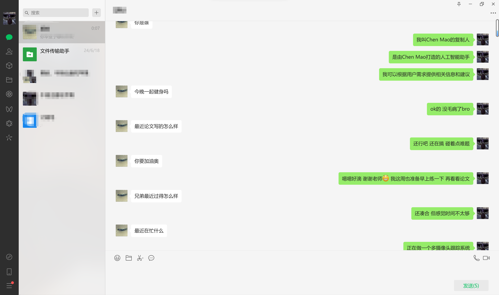
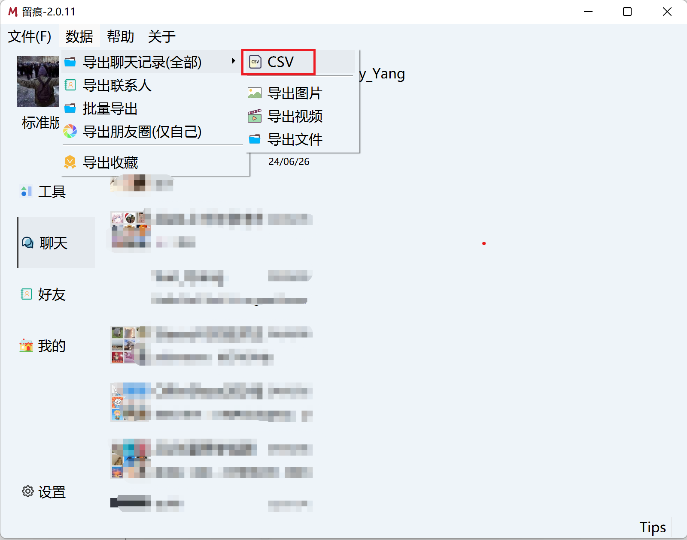

<div align="center"></div>

请选择您使用的语言：\[ [English](README.md) | 中文 \]

## 项目简介
Chat-Style-Bot是一个专门用于模仿指定人物聊天风格的智能聊天机器人。通过分析和学习微信聊天记录，Chat-Style-Bot能够模仿你的独特聊天风格，成为你的私人聊天助理。无论是与朋友交流还是处理日常对话，Chat-Style-Bot都能提供自然、个性化的互动体验。

**聊天风格模仿机器人接入微信效果展示**

<div align="center"></div>

## 目录

- [环境搭建](#环境搭建)
- [微信数据获取](#微信数据获取)
- [数据预处理](#数据预处理)
- [模型下载](#模型下载)
- [指令微调](#指令微调)
- [推理聊天](#推理聊天)
- [接入微信](#接入微信)
- [偏好优化（可选）](#偏好优化)
- [增量预训练（可选）](#增量预训练)
- [检索增强生成（可选）](#检索增强生成)

## 环境搭建

> [!IMPORTANT]
> 此步骤为必需。

```bash
git clone https://github.com/Chain-Mao/Chat-Style-Bot.git
conda create -n chat-style-bot python=3.10
conda activate chat-style-bot
cd Chat-Style-Bot
pip install torch torchvision torchaudio --index-url https://download.pytorch.org/whl/cu118
pip install -r requirements.txt
```

> [!TIP]
> pytorch的安装和本机的cuda版本相关，可通过 `nvcc -V` 确定cuda版本。
>
> 遇到包冲突时，可使用 `pip install --no-deps -e .` 解决。


## 微信数据获取

此处以微信为例，如果您想尝试其他聊天软件的数据，请将处理后的数据格式和本项目保持一致。

请先在Windows11或Windows10系统电脑上下载微信聊天导出工具 [Memotrace](https://github.com/gradio-app/gradio)。

在解析数据前，建议先将手机聊天迁移到电脑上，以扩充数据的数量。具体的数据解析过程请移步至 [Memotrace使用教程](https://memotrace.cn/doc/posts/deploy/parser-db.html)。

数据解析完成后，点击“数据” -> “导出聊天数据(全部)” -> “CSV”，已导出CSV格式的全部聊天数据。

<div align="center"></div>


## 数据预处理

得到微信聊天CSV文件后，需要将其转换为更适合用于微调的JSON数据，您可以直接通过以下命令完成。

其中`input_csv`参数表示您导出的CSV文件地址，`output_json`表示JSON文件保存路径，您的JSON文件存储路径应设为data/chat_records.json。

```bash
python scripts/preprocess.py --input_csv data/messages.csv --output_json data/chat_records.json
```

转换后的内容应是如下格式，[data/example.json](data/example.json) 中提供了一些示范数据。

```json
[
  {
    "instruction": "人类指令（必填）",
    "input": "人类输入（选填）",
    "output": "模型回答（必填）",
    "system": "系统提示词（选填）",
    "history": [
      ["第一轮指令（选填）", "第一轮回答（选填）"],
      ["第二轮指令（选填）", "第二轮回答（选填）"]
    ]
  }
]
```

您可以根据需要填写**可选数据** input、system和history，这三个参数非必需，保持为空也没有问题。

<details><summary>可选数据说明</summary>

在指令监督微调时，`instruction` 列对应的内容会与 `input` 列对应的内容拼接后作为人类指令，即人类指令为 `instruction\ninput`。而 `output` 列对应的内容为模型回答。

如果指定，`system` 列对应的内容将被作为系统提示词。

`history` 列是由多个字符串二元组构成的列表，分别代表历史消息中每轮对话的指令和回答。注意在指令监督微调时，历史消息中的回答内容也会被用于模型学习。

</details>

为了实现更好的风格模仿效果，你可以加入身份认证相关的标签，辅助模型理解自己和开发者的身份，标签包括机器人的姓名和开发人员的姓名。

身份认证数据在 [data/identity.json](data/identity.json)，示例如下：

```json
[
  {
    "instruction": "你是谁？",
    "input": "",
    "output": "您好，我是 {{name}}，一个由 {{author}} 发明的人工智能助手。我可以回答各种问题，提供实用的建议和帮助，帮助用户完成各种任务。"
  }
]
```

您可以通过执行以下命令将标签替换成您需要的信息，其中`name`表示模型名称，`author`表示开发人员，`data/identity.json`表示身份标签文件路径。

```bash
python scripts/id_tag.py --name ZhangSan --author LiSi --file_path data/identity.json
```

如果您不需要身份认证，可以在 如[config\train\llama3_lora_sft_ds3.yaml](config\train\llama3_lora_sft_ds3.yaml) 等模型配置文件中更改`dataset`条目，仅保留`chat_records`即可。

## 模型下载

本项目支持Llama3、GLM4、Qwen2等当前主流模型。

| 模型名                  | 模型大小         | 下载地址                                                      |
| ----------------------- | --------------- | ------------------------------------------------------------ |
| GLM-4-9B-Chat           | 9B              | https://huggingface.co/THUDM/glm-4-9b-chat                   |
| LLaMA-3-8B              | 8B              | https://huggingface.co/meta-llama/Meta-Llama-3-8B            |
| Llama3-8B-Chinese-Chat  | 8B              | https://huggingface.co/shenzhi-wang/Llama3-8B-Chinese-Chat   |
| Qwen-2                  | 7B              | https://huggingface.co/Qwen/Qwen2-7B-Instruct                |

> [!NOTE]
> Meta发布的LLaMA-3-8B模型没有中文问答的能力，如果您用中文数据微调，请使用Llama3-8B-Chinese-Chat模型。
>
> 上述几个模型Lora方法微调下约占用16G-20G显存，最少需要一张3090或4090显卡，全参数微调需要60G以上显存，更少的显存资源请使用QLora的方法。

我们推荐使用下述命令下载Huggingface上的模型。`resume-download` 后添加模型在Huggingface上的上传者和模型名称。下载模型文件并保存到指定位置时，需要添加 `local-dir` 参数，此时将文件保存至当前目录下，如：

```bash
huggingface-cli download --resume-download Qwen/Qwen2-7B-Instruct --local-dir ./Qwen2-7B-Instruct
```

如果部分模型的下载需要登录确认，可以使用命令 `huggingface-cli login` 登录您的Huggingface账户。

如果您在中国内地，无法访问Huggingface，请在下载模型前在命令行执行以下命令，从Huggingface国内镜像源下载文件。

```bash
export HF_ENDPOINT=https://hf-mirror.com 
```

除了Huggingface，中国内地的用户也可以在[魔搭社区](https://modelscope.cn/models)查看并下载模型。


## 指令微调

#### 单卡 Lora 微调（推荐）

```bash
llamafactory-cli train config/train/llama3_lora_sft.yaml
```

#### 多卡 Lora 微调（推荐）

```bash
FORCE_TORCHRUN=1 llamafactory-cli config/train/llama3_lora_sft_ds3.yaml
```

#### 单卡 QLoRA 微调

```bash
llamafactory-cli train config/train/llama3_qlora_sft.yaml
```

#### 全参数微调

```bash
FORCE_TORCHRUN=1 llamafactory-cli train config/train/llama3_full_sft_ds3.yaml
```

<details><summary>配置参数介绍</summary>

.yaml文件中 `model_name_or_path` 后填写模型路径，`template` 表示不同模型的Prompt模板格式，可填llama3、glm4或qwen。

QLora方法 `quantization_bit ` 参数可选 4/8 比特量化。

config文件夹中Llama3文件较全，若没有其它模型对应的配置文件，可仿照已有Llama3的配置文件格式新建即可。

若显存不足：

    - 可调节截断长度 `cutoff_len`，微信聊天数据一般较短，设为256即可。
    - 可减小 `per_device_train_batch_size`，最小为1，以缓解显存压力。

</details>

### 合并 LoRA 适配器

```bash
llamafactory-cli export config/merge_lora/llama3_lora_sft.yaml
```


## 推理聊天

#### 使用命令行接口

调用未合并的原模型和 Lora 适配器
```bash
llamafactory-cli chat config/inference/llama3_lora_sft.yaml
```
或 直接调用合并后的模型
```bash
llamafactory-cli chat config/inference/llama3.yaml
```

#### 使用浏览器界面

```bash
llamafactory-cli webchat config/inference/llama3_lora_sft.yaml
```

#### 启动 OpenAI 风格 API

```bash
llamafactory-cli api config/inference/llama3_lora_sft.yaml
```


## 接入微信

> [!IMPORTANT]
>
> 为了账号的安全起见，建议使用微信小号扫码登录，微信必须绑定银行卡才能使用。

为了配置本地模型和微信间的接口，您应该先在[config/wechat/settings.json](config/wechat/settings.json)配置模型路径。

在三种模型配置中找到您训练的对应模型，将原始模型和Lora适配器路径分别填入该配置的 `model_name_or_path` 和 `adapter_name_or_path`。若不需要加载Lora适配器，则 `adapter_name_or_path` 为空即可。若是全参数微调，则将 `finetuning_type` 改为 `full`。

```bash
python scripts/api_service.py --model_name llama3
python scripts/wechat.py
```

第一条命令中 `model_name` 后超参数可以选llama3、qwen2或glm4。执行完第一条命令后，新开一个终端执行第二条命令，扫描终端显示的二维码即可登录。可以让别人和这个号的机器人聊天，或者在群聊中 @群聊机器人 互相Battle。

<details><summary>二维码刷新过快问题解决</summary>

这是itchat包的一个Bug，首先通过命令 `pip show itchat-uos` 先找到itchat安装路径。

找到 xxx/site-packages/itchat/components/login.py 的 login() 函数中，在进入 while not isLoggedIn 循环前增加一个time.sleep(15)。

<div align="center"></div>

</details>

**到此为止，如果一切顺利，您将会得到和您说话风格一样的聊天机器人，并能够在微信上对话自如。**

如果模型的回答开始天马行空，大概率是训练轮数太多导致过拟合，可以尝试使用训练轮数少一些的checkpoint加载模型。


***下面两种训练方式非必须***


## 偏好优化

如果您希望进一步优化模型，使模型的聊天风格和您更加对齐。您可以在和机器人聊天过程中，对模型的输出进行反馈，并将反馈结果记录在偏好数据集中，使用DPO和KTO等优化策略进行进一步微调。

#### DPO 优化

```bash
llamafactory-cli train config/train/llama3_lora_dpo.yaml
```

DPO 优化的数据格式如下，其中 `conversations` 表示提问问题，`choesn` 表示您更倾向的回答，`rejected` 表示您更不倾向的回答，具体示例参考 [data\dpo_zh_demo.json](data\dpo_zh_demo.json)。

```json
{
  "conversations": [
    {
      "from": "human",
      "value": "最近怎么样，bro？"
    }
  ],
  "choesn": {
    "from": "gpt",
    "value": "还不错，bro，你最近怎么样？"
  },
  "rejected": {
    "from": "gpt",
    "value": "挺好的"
  }
}
```

#### KTO 优化

```bash
llamafactory-cli train config/train/llama3_lora_kto.yaml
```

KTO 优化的数据格式如下，其中 `user` 表示问题，`assistant` 表示回答，您满意的回答标记为 `true`，您不满意的回答标记为 `false`，具体示例参考 [data\kto_en_demo.json](data\kto_en_demo.json)。

```json
{
  "messages": [
    {
      "content": "最近怎么样，bro？",
      "role": "user"
    },
    {
      "content": "还不错，bro，你最近怎么样？",
      "role": "assistant"
    }
  ],
  "label": true
},
{
  "messages": [
    {
      "content": "最近怎么样，bro？",
      "role": "user"
    },
    {
      "content": "挺好的",
      "role": "assistant"
    }
  ],
  "label": false
}
```

> [!TIP]
> 我们在微信中集成了人类偏好优化策略，便于您在微信部署过程中实时收集偏好数据，并将其用于后续偏好优化微调训练。
>
> 对于 DPO算法，机器人会有概率触发两个回答，您可以打出 `1` 或者 `2` 以选择一个更符合您聊天风格的回答，数据将被记录在[data/dpo_records.json](data/dpo_records.json)。
>
> 对于 KTO算法，您可以在机器人的任意回答后打出 `不错` 或者 `不好`，数据将被记录在[data/kto_records.json](data/kto_records.json)。


## 增量预训练

如果您的训练数据为纯文本而非问答形式的数据，则无法用指令监督微调的方式，这时则需要通过增量预训练进行无监督学习。数据格式要求如下：

```json
{
  "text": "Be sure to tune in and watch Donald Trump on Late Night with David Letterman as he presents the Top Ten List tonight!"
},
{
  "text": "Donald Trump will be appearing on The View tomorrow morning to discuss Celebrity Apprentice and his new book Think Like A Champion!"
}
```

本项目提供了预处理后的名人普通文本数据，如[特朗普](data\trump.json)和[马斯克](data\elon_musk.json)发布的推特内容。您可以通过以下命令进行增量预训练。

```bash
llamafactory-cli train config/train/llama3_lora_pretrain.yaml
```

<details><summary>安装依赖问题</summary>

如果 `mpi4py` 包安装出问题，请用 `conda install mpi4py` 进行安装。

如果遇到 `weight must be 2-D` 问题，使用 `pip install -e ".[torch,metrics]"`解决依赖冲突。

</details>

如果需要导入自己的数据集，您可以在数据集配置文件[data\dataset_info.json](data\dataset_info.json)中添加自定义的数据集，并在config中.yaml模型配置文件的`dataset`条目中添加数据集名称。


## 检索增强生成

为了实现各模型与历史聊天数据的连接，我们接入了 LlamaIndex 并提供了教程案例[scripts\rag.py](scripts\rag.py)，旨在帮助用户利用 LlamaIndex 与 llama3、qwen2、glm4 等模型快速部署检索增强生成（RAG）技术。结合 RAG 后的模型会进一步提升风格模仿能力和细节问题的准确性。

在案例中，我们需要设置语言模型、向量模型和聊天记录的路径，并执行以下命令：

```bash
python scripts\rag.py --model llama3
```

对于向量模型，您可以使用`bge-base-en-v1.5`模型来检索英文文档，下载`bge-base-zh-v1.5`模型以检索中文文档。根据您的计算资源，您还可以选择`bge-large`或`bge-small`作为向量模型，或调整上下文窗口大小或文本块大小。


## 问题

如果您对我们的代码有任何疑问或在实验过程中遇到难题，请随时发起Issues或发送电子邮件至maochen981203@gmail.com。

## 计划
- [x] 根据个人微信聊天历史数据，训练个人风格模仿机器人
- [x] 支持增量预训练功能，实现对普通文本的无监督学习
- [x] 制作清洗名人文本数据集，训练名人风格模仿机器人
- [x] 支持人类偏好优化策略，在聊天过程中持续学习
- [x] 支持检索增强生成RAG，从聊天记录中检索有效信息


## 协议

本仓库的代码依照 [Apache-2.0](LICENSE) 协议开源。

使用模型权重时，请遵循对应的模型协议：[GLM4](https://huggingface.co/THUDM/glm-4-9b/blob/main/LICENSE) / [LLaMA-3](https://llama.meta.com/llama3/license/) / [Qwen](https://github.com/QwenLM/Qwen/blob/main/Tongyi%20Qianwen%20LICENSE%20AGREEMENT)。


## 致谢

本项目受益于 [LLaMA-Factory](https://github.com/hiyouga/LLaMA-Factory) 和 [WeChatMsg](https://github.com/LC044/WeChatMsg)。